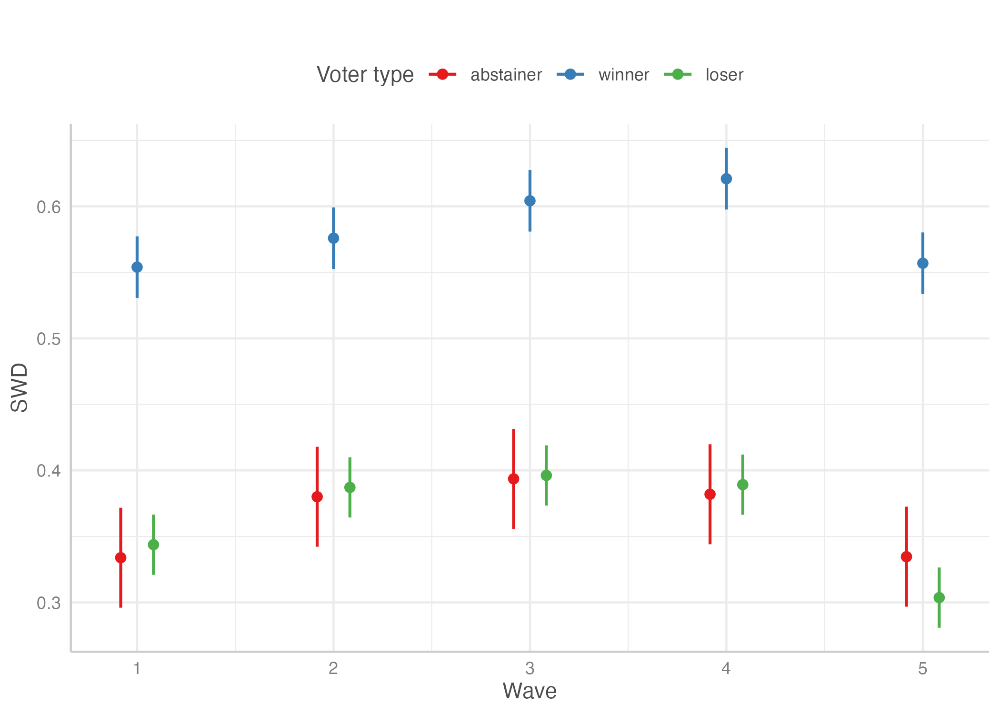
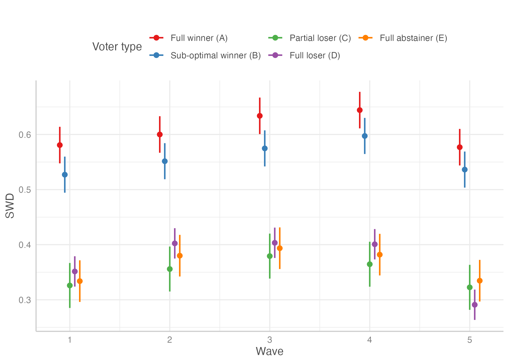
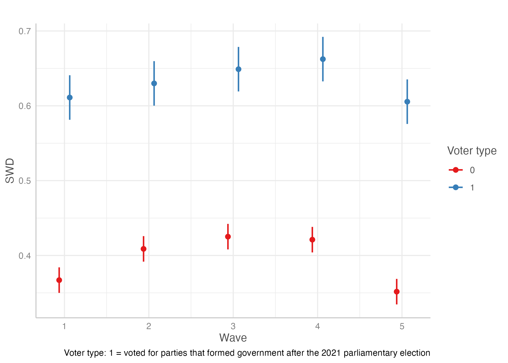

```{r setup, include=FALSE}
knitr::opts_chunk$set(echo = TRUE, warning = FALSE, message = FALSE)

library(lme4)
library(boot)
library(dplyr)
library(Hmisc)
library(sjPlot)
library(lmtest)
library(targets)
library(ggplot2)
library(margins)
library(sandwich)
library(estimatr)
library(ggeffects)
library(modelsummary)
library(marginaleffects)

options("modelsummary_format_numeric_latex" = "plain")

source("R/funs.R")

tar_load(cz_2023_models)
tar_load(all_panels)
```

# Modely do main textu

## Table 2: Descriptive stats of SWD
```{r, message=FALSE}
cz_2023 <- cz_2023_models

mean_swd <- function(data, indices){
    dt <- data[indices, ]
    c(
        mean(dt$SWD_w1, na.rm = TRUE), 
        mean(dt$SWD_w2, na.rm = TRUE), 
        mean(dt$SWD_w3, na.rm = TRUE), 
        mean(dt$SWD_w4, na.rm = TRUE), 
        mean(dt$SWD_w5, na.rm = TRUE)
    )
}

set.seed(1234)
boot_swd <- boot(data = cz_2023, mean_swd, R = 1000)
boot_ci_w1 <- boot.ci(boot_swd, type = "norm", index = 1)
boot_ci_w2 <- boot.ci(boot_swd, type = "norm", index = 2)
boot_ci_w3 <- boot.ci(boot_swd, type = "norm", index = 3)
boot_ci_w4 <- boot.ci(boot_swd, type = "norm", index = 4)
boot_ci_w5 <- boot.ci(boot_swd, type = "norm", index = 5)

boot_to_df <- function(boot_ci){
  data.frame(
    mean = boot_ci$t0, 
    lower = boot_ci$normal[, 2], 
    upper = boot_ci$normal[, 3]
  )
}

waves <- tribble(
    ~wave, ~start_date, ~end_date,
    "Wave 1", "2022-11-25", "2022-12-06",
    "Wave 2", "2023-01-09", "2023-01-13",
    "Wave 3", "2023-01-16", "2023-01-22", 
    "Wave 4", "2023-01-30", "2023-02-06", 
    "Wave 5", "2023-06-19", "2023-07-03"
) %>% 
    mutate(across(ends_with("date"), as.Date), 
           mid_date = start_date + ((end_date - start_date) / 2)) %>% 
    mutate(wave_label = case_when(
      wave == "Wave 1" ~ "Wave 1 (25.11.–6.12.)", 
      wave == "Wave 2" ~ "Wave 2 (9.–13.1.)",
      wave == "Wave 3" ~ "Wave 3 (16.–22.1.)", 
      wave == "Wave 4" ~ "Wave 4 (30.1.–6.2.)",
      wave == "Wave 5" ~ "Wave 5 (19.6.–3.7.)"
    ))

elections <- tribble(
    ~round, ~start_date, ~end_date, 
    "Round 1", "2023-01-13", "2023-01-14",
    "Round 2", "2023-01-27", "2023-01-28"
) %>% 
    mutate(across(ends_with("date"), as.Date))

boot_swd_w1_5 <- purrr::map_df(
  list(boot_ci_w1, boot_ci_w2, boot_ci_w3, 
       boot_ci_w4, boot_ci_w5), 
           boot_to_df) %>% 
  mutate(wave = paste("Wave ", row_number(), sep = "")) %>% 
  left_join(., waves %>% select(wave, mid_date, wave_label), by = "wave")
```


```{r}
Y_MIN <- 0.25
Y_MAX <- 0.75

boot_swd_w1_5 <- boot_swd_w1_5 %>% 
  mutate(across(c(mean, lower, upper), function(x) x / 10))

ggplot(waves) + 
    geom_rect(aes(xmin = start_date, xmax = end_date, 
                  ymin = Y_MIN, ymax = Y_MAX), 
              fill = "gray60", alpha = 0.5
              ) + 
  geom_rect(data = elections, aes(
    xmin = start_date, xmax = end_date, 
    ymin = Y_MIN, ymax = Y_MAX), 
    fill = "black") + 
  geom_text(x = as.Date("2023-01-14"), y = Y_MIN, 
            label = "Round 1", 
            colour = "black", angle = 90, 
            hjust = -0.1, vjust = 1.1, 
            size = 3.25) + 
  geom_text(x = as.Date("2023-01-28"), y = Y_MIN, 
            label = "Round 2", 
            colour = "black", angle = 90, 
            hjust = -0.1, vjust = 1.1, 
            size = 3.25) + 
  geom_text(aes(x = mid_date, label = wave_label), 
            y = Y_MAX, angle = 90, hjust = 1.05, 
            size = 3.25) + 
  geom_pointrange(data = boot_swd_w1_5,
                  aes(x = mid_date, y = mean, ymax = upper,
                      ymin = lower), shape = 16) +
  theme_minimal() + 
  scale_y_continuous(limits = c(Y_MIN, Y_MAX)) + 
  guides(alpha = "none") + 
  scale_x_date(date_labels = "%b %Y", date_breaks = "month") + 
  labs(x = "", # title = "2023 Czech presidential election panel", 
       y = "Average SWD (0–1 scale)", 
       # caption = "Note: Black points depict average SWD within the wave (all respondents participating in a given wave included)\nwith bootstrapped 95% confidence intervals. Grey rectangles show the dates of data collection, red lines indicate election days."
       ) 
ggsave("output/fig1_wave_swd.png", width = 8, 
       height = 4)
```

```{r}
avg_swd_cz2023 <- cz_2023 %>% 
  # filter(w1 == 1 & w2 == 1 & w3 == 1 & w4 == 1 & w5 == 1) %>% 
  mutate(across(matches("SWD_w[0-9]+"), 
                function(x) x / 10)) %>% 
  summarise(across(matches("SWD_w[0-9]+"), ~round(mean(.x, na.rm = TRUE), 2)))

# avg_swd_cz2023 %>% 
#     knitr::kable(., format = "latex") %>% 
#     writeLines(., "output/avg_swd_cz2023_panel.tex")

avg_swd_cz2023 %>% 
    knitr::kable()
```
```{r}
mean_swd_pre_post <- function(data, indices){
    dt <- data[indices, ]
    boot_swd_pre <- mean(dt$swd_pre, na.rm = TRUE) 
    boot_swd_post <- mean(dt$swd_post, na.rm = TRUE)
    c(
        boot_swd_pre, 
        boot_swd_post, 
        boot_swd_post - boot_swd_pre
    )
}

boot_ci_swd <- function(boot_out){
  ci_pre <- boot_to_df(boot.ci(boot_out, type = "norm", index = 1)) %>% 
    rename_with(., ~paste0("swd_pre_", .x))
  ci_post <- boot_to_df(boot.ci(boot_out, type = "norm", index = 2)) %>% 
    rename_with(., ~paste0("swd_post_", .x))
  ci_diff <- boot_to_df(boot.ci(boot_out, type = "norm", index = 3)) %>% 
    rename_with(., ~paste0("swd_diff_", .x))
  
  bind_cols(
    ci_pre, ci_post, ci_diff
  )
}


cz_2023_avg <- all_panels %>% 
    filter(election == "CZ 2023") %>% 
    filter(!is.na(swd_pre) & !is.na(swd_post))
cz_1996_avg <- all_panels %>% 
    filter(election == "CZ 1996") %>% 
    filter(!is.na(swd_pre) & !is.na(swd_post))
de_2017_avg <- all_panels %>% 
  filter(election == "DE (Ost) 2017") %>% 
  filter(!is.na(swd_pre) & !is.na(swd_post))
hu_2019_avg <- all_panels %>% 
  filter(election == "HU 2019") %>% 
  filter(!is.na(swd_pre) & !is.na(swd_post))
pl_2019_avg <- all_panels %>% 
  filter(election == "PL 2019") %>% 
  filter(!is.na(swd_pre) & !is.na(swd_post))
ro_2009_avg <- all_panels %>% 
  filter(election == "RO 2009") %>% 
  filter(!is.na(swd_pre) & !is.na(swd_post))
ro_2012_avg <- all_panels %>% 
  filter(election == "RO 2012") %>% 
  filter(!is.na(swd_pre) & !is.na(swd_post))

set.seed(1234)
boot_cz_1996 <- boot_ci_swd(boot(cz_1996_avg, mean_swd_pre_post, R = 1000))
boot_cz_2023 <- boot_ci_swd(boot(cz_2023_avg, mean_swd_pre_post, R = 1000))
boot_de_2017 <- boot_ci_swd(boot(de_2017_avg, mean_swd_pre_post, R = 1000))
boot_hu_2019 <- boot_ci_swd(boot(hu_2019_avg, mean_swd_pre_post, R = 1000))
boot_pl_2019 <- boot_ci_swd(boot(pl_2019_avg, mean_swd_pre_post, R = 1000))
boot_ro_2009 <- boot_ci_swd(boot(ro_2009_avg, mean_swd_pre_post, R = 1000))
boot_ro_2012 <- boot_ci_swd(boot(ro_2012_avg, mean_swd_pre_post, R = 1000))

bootstrap_out <- purrr::map2_df(
  c("CZ 1996", "CZ 2023", "DE 2017", 
    "HU 2019", "PL 2019", "RO 2009", 
    "RO 2012"), 
  list(
    boot_cz_1996, boot_cz_2023, boot_de_2017, 
    boot_hu_2019, boot_pl_2019, boot_ro_2009, 
    boot_ro_2012
  ), function(x, y) {
    y %>% mutate(election = x)
  }
)

f2d <- function(x) format(x, nsmall = 2, trim = TRUE)

n <- all_panels %>% 
    group_by(election) %>% 
    filter(!is.na(swd_pre) & !is.na(swd_post)) %>% 
    summarise(n = n()) %>% 
    mutate(election = if_else(election == "DE (Ost) 2017", 
                              "DE 2017", election))

avg_swd_all_panels <- bootstrap_out %>% 
  mutate(
    country = case_when(
      grepl("CZ", election) ~ "Czech Republic", 
      grepl("DE", election) ~ "Germany (East)",
      grepl("PL", election) ~ "Poland", 
      grepl("HU", election) ~ "Hungary", 
      grepl("RO", election) ~ "Romania"
    ), 
    year = stringr::str_extract(election, "[0-9]{4}"), 
    election_type = case_when(
      election %in% c("CZ 2023", "RO 2009") ~ "presidential", 
      election %in% c("PL 2019", "HU 2019") ~ "EP election", 
      TRUE ~ "parliamentary"
    )) %>% 
  select(election, country, year, election_type, matches("swd_")) %>% 
  mutate(across(matches("swd_"), ~round(.x, 2))) %>% 
  mutate(swd_pre = paste0(f2d(swd_pre_mean), " (", f2d(swd_pre_lower), 
                          " – ", f2d(swd_pre_upper), ")"), 
         swd_post = paste0(f2d(swd_post_mean), " (", f2d(swd_post_lower), 
                           " – ", f2d(swd_post_upper), ")"), 
         swd_diff = paste0(f2d(swd_diff_mean), " (", f2d(swd_diff_lower), " – ", 
                           f2d(swd_diff_upper), ")")
         ) %>% 
  left_join(., n, by = "election") %>% 
  select(country, year, election_type, swd_pre, swd_post, swd_diff, n) 

avg_swd_all_panels %>% 
    knitr::kable(., format = "latex", col.names = c(
      "Country", "Year", "Type of election", "Pre-election SWD",
      "Post-election SWD", "SWD difference", "N"
    )) %>% 
    writeLines(., "output/tab2.tex")

avg_swd_all_panels %>% 
    knitr::kable(col.names = c(
      "Country", "Year", "Type of election", "Pre-election SWD",
      "Post-election SWD", "SWD difference", "N"
    ))
```


## Table 3: Turnout and satisfaction with democracy, 2023 Czech presidential election
```{r}
tar_load(cz_2023_all_waves_resp)

r2 <- function(null_model, model){
  round(1 - as.numeric(logLik(model)) /
          as.numeric(logLik(null_model)), 2)
}

ce0_round1 <- glm(voted_1r ~ 1, 
           data = cz_2023_all_waves_resp,
           family = binomial(link = "logit"), 
           weights = weight_turnout) %>% 
  coeftest(., vcov = vcovHC(., type="HC1")) 
ce1_round1 <- glm(voted_1r ~ SWD_w1 + SWD_w4, 
           data = cz_2023_all_waves_resp,
           family = binomial(link = "logit"), 
           weights = weight_turnout) %>% 
  coeftest(., vcov = vcovHC(., type="HC1")) 
ce2_round1 <- glm(voted_1r ~ SWD_w1 + female + age + 
                    postsecondary_edu + duty_to_vote + 
             pol_interest_num + pol_knowledge + party_close, 
           data = cz_2023_all_waves_resp, 
           family = binomial(link = "logit"), 
           weights = weight_turnout) %>% 
  coeftest(., vcov = vcovHC(., type="HC1")) 
ce3_round1 <- glm(voted_1r ~ SWD_w4 + female + age + 
                    postsecondary_edu + duty_to_vote + 
             pol_interest_num + pol_knowledge + party_close, 
           data = cz_2023_all_waves_resp, 
           family = binomial(link = "logit"), 
           weights = weight_turnout) %>% 
  coeftest(., vcov = vcovHC(., type="HC1")) 
ce4_round1 <- glm(voted_1r ~ SWD_w1 + SWD_w4 + 
             female + age + postsecondary_edu + duty_to_vote + 
             pol_interest_num + pol_knowledge + 
             party_close, 
           data = cz_2023_all_waves_resp, 
           family = binomial(link = "logit"), 
           weights = weight_turnout) %>% 
  coeftest(., vcov = vcovHC(., type="HC1")) 

ce0_round2 <- glm(voted_2r ~ 1, 
           data = cz_2023_all_waves_resp,
           family = binomial(link = "logit"), 
           weights = weight_turnout) %>% 
  coeftest(., vcov = vcovHC(., type="HC1")) 
ce1_round2 <- glm(voted_2r ~ SWD_w1 + SWD_w4, 
           data = cz_2023_all_waves_resp,
           family = binomial(link = "logit"), 
           weights = weight_turnout) %>% 
  coeftest(., vcov = vcovHC(., type="HC1")) 
ce2_round2 <- glm(voted_2r ~ SWD_w1 + female + 
                    age + postsecondary_edu + duty_to_vote + 
             pol_interest_num + pol_knowledge + party_close, 
           data = cz_2023_all_waves_resp, 
           family = binomial(link = "logit"), 
           weights = weight_turnout) %>% 
  coeftest(., vcov = vcovHC(., type="HC1")) 
ce3_round2 <- glm(voted_2r ~ SWD_w4 + female + age +
                    postsecondary_edu + 
             duty_to_vote + pol_interest_num + 
               pol_knowledge + party_close, 
           data = cz_2023_all_waves_resp, 
           family = binomial(link = "logit"), 
           weights = weight_turnout) %>% 
  coeftest(., vcov = vcovHC(., type="HC1")) 
ce4_round2 <- glm(voted_2r ~ SWD_w1 + SWD_w4 + 
             female + age + postsecondary_edu + 
             duty_to_vote + pol_interest_num + pol_knowledge + 
             party_close, 
           data = cz_2023_all_waves_resp, 
           family = binomial(link = "logit"), 
           weights = weight_turnout) %>% 
  coeftest(., vcov = vcovHC(., type="HC1")) 

pr2 <- tribble(~term, ~m1, ~m2, ~m3, ~m4, ~m5, ~m6, ~m7, ~m8,
               "PseudoR2 (McFadden)",
               r2(ce0_round1, ce1_round1), 
               r2(ce0_round1, ce2_round1), 
               r2(ce0_round1, ce3_round1), 
               r2(ce0_round1, ce4_round1), 
               r2(ce0_round2, ce1_round2),
               r2(ce0_round2, ce2_round2),
               r2(ce0_round2, ce3_round2),
               r2(ce0_round2, ce4_round2))

model_n_vars <- broom::tidy(ce4_round1) %>%
    filter(!grepl("election", term)) %>%
    nrow()

attr(pr2, "position") <- (model_n_vars * 2) + 1

modelsummary(list("Round 1" = ce1_round1, "Round 1" = ce2_round1, 
                  "Round 1" = ce3_round1, "Round 1" = ce4_round1, 
                  "Round 2" = ce1_round2, "Round 2" = ce2_round2, 
                  "Round 2" = ce3_round2, "Round 2" = ce4_round2), 
             stars = c("*"=.05, "**"=.01, "***"=0.001), 
             fmt = 2, coef_map = c(
                 "SWD_w1" = "Pre-election satisfaction (Wave 1)",
                 "SWD_w4" = "Post-election satisfaction (Wave 4)", 
                 "female" = "Female",
                 "age" = "Age", 
                 "postsecondary_edu" = "Post-secondary education", 
                 "duty_to_vote" = "Duty to vote", 
                 "pol_interest_num" = "Interest in politics",
                 "pol_knowledge" = "Political knowledge", 
                 "party_close" = "Feels close to a party", 
                 "(Intercept)" = "Intercept"
             ), 
             add_rows = pr2,
             # notes = c("Data weighted by turnout."),
             # title = "Turnout and satisfaction with democracy, 2023 Czech presidential election",
             gof_map = "nobs",
             output = "output/tab3_models.tex")


modelsummary(list("Round 1" = ce1_round1, "Round 1" = ce2_round1, 
                  "Round 1" = ce3_round1, "Round 1" = ce4_round1, 
                  "Round 2" = ce1_round2, "Round 2" = ce2_round2, 
                  "Round 2" = ce3_round2, "Round 2" = ce4_round2), 
             stars = c("*"=.05, "**"=.01, "***"=0.001), 
             fmt = 2, coef_map = c(
                 "SWD_w1" = "Pre-election satisfaction (Wave 1)",
                 "SWD_w4" = "Post-election satisfaction (Wave 4)", 
                 "female" = "Female",
                 "age" = "Age", 
                 "postsecondary_edu" = "Post-secondary education", 
                 "duty_to_vote" = "Duty to vote", 
                 "pol_interest_num" = "Interest in politics",
                 "pol_knowledge" = "Political knowledge", 
                 "party_close" = "Feels close to a party", 
                 "(Intercept)" = "Intercept"
             ), 
             add_rows = pr2,
             # notes = c("Data weighted by turnout."),
             # title = "Turnout and satisfaction with democracy, 2023 Czech presidential election",
             gof_map = "nobs")

```

### AMEs
#### Model 2
```{r}
ce2_round1_ame <- glm(voted_1r ~ SWD_w1 + female + age + 
                    postsecondary_edu + duty_to_vote + 
             pol_interest_num + pol_knowledge + party_close, 
           data = cz_2023_all_waves_resp, 
           family = binomial(link = "logit"), 
           weights = weight_turnout)

avg_slopes(ce2_round1_ame, 
           variables = "SWD_w1", 
           vcov = "HC1", 
           wts = "weight_turnout")

```

#### Model 6
```{r}
ce2_round2_ame <- glm(voted_2r ~ SWD_w1 + female + 
                    age + postsecondary_edu + duty_to_vote + 
             pol_interest_num + pol_knowledge + party_close, 
           data = cz_2023_all_waves_resp, 
           family = binomial(link = "logit"), 
           weights = weight_turnout)

avg_slopes(ce2_round2_ame, 
           variables = "SWD_w1", 
           vcov = "HC1", 
           wts = "weight_turnout")
```

## Table 4: SWD change, CZ 2023 panel
```{r}
pavel_voters <- cz_2023_all_waves_resp %>% 
  filter(PRES2023CAND2r_w4 == "Petr Pavel")

swd1_round1 <- lm_robust(swd_diff ~ voted_1r + voted_2r + 
                           swd_pre + female + 
                           age +
                    postsecondary_edu + pol_interest_num + 
                    pol_knowledge + party_close + duty_to_vote, 
             data = cz_2023_all_waves_resp, 
             weights = weight_turnout, 
          se_type = "stata")

swd1_round1b <- lm_robust(swd_diff ~ voted_1r + voted_2r +
                            swd_pre + female + 
                            age +
                    postsecondary_edu + pol_interest_num + 
                    pol_knowledge + party_close + duty_to_vote, 
             data = cz_2023_all_waves_resp, 
             weights = weight_turnout, 
             se_type = "stata")

swd3_round1 <- lm_robust(swd_diff ~ voter_type + swd_pre + 
                           female + age +
                    postsecondary_edu + pol_interest_num + 
                    pol_knowledge + party_close + duty_to_vote, 
                  data = cz_2023_all_waves_resp, 
                  weights = weight_turnout, 
                  se_type = "stata")

swd4_round1 <- lm_robust(swd_diff ~ prez_vote_type + swd_pre + 
                    female + age +
                      postsecondary_edu + pol_interest_num + 
                      pol_knowledge + party_close + duty_to_vote, 
                  data = cz_2023_all_waves_resp, 
                  weights = weight_turnout, 
                  se_type = "stata")

swd5_round1 <- lm_robust(swd_diff ~ stable_voter + swd_pre + 
                           female + age +
                    postsecondary_edu + pol_interest_num + 
                    pol_knowledge + party_close + duty_to_vote, 
                  data = pavel_voters, 
                  weights = weight_turnout, 
                  se_type = "stata")
swd5_round1_ord <- lm_robust(swd_diff ~ pavel_decision + swd_pre + 
                        female + age +
                    postsecondary_edu + pol_interest_num + 
                    pol_knowledge + party_close + duty_to_vote, 
                  data = pavel_voters, 
                  weights = weight_turnout, 
                  se_type = "stata")

modelsummary(list(swd1_round1, swd3_round1, 
                  swd4_round1, swd5_round1
                  ), 
             stars = c("*"=.05, "**"=.01, "***"=0.001),
             coef_map = c(
               "voted_1r" = "Voted (R1)",
               "voted_2r" = "Voted (R2)",
               "voter_typeVoted for winner" = "Winner",
               "voter_typeVoted for loser" = "Loser",
               "prez_vote_typefull winner" = "Full winner (A)",
               "prez_vote_typesub-optimal winner" = "Sub-optimal winner (B)",
               "prez_vote_typepartial loser" = "Partial loser (C)",
               "prez_vote_typefull loser" = "Full loser (D)",
               "stable_voter" = "Stable winner", 
               "swd_pre" = "Pre-election SWD",
               "female" = "Female",
               "age" = "Age",
               "postsecondary_edu" = "Post-secondary education",
               "pol_interest_num" = "Pol. interest", 
               "pol_knowledge" = "Pol. knowledge",
               "party_close" = "Feels close to a party",
               "duty_to_vote" = "Duty to vote",
               "(Intercept)"="Intercept"
             ), 
             fmt = 2,
             gof_map = c("nobs", "r.squared", "adj.r.squared"),
             # notes = c("Data weighted by turnout."),
             output = "output/tab4_models.tex")

modelsummary(list(swd1_round1, swd3_round1, 
                  swd4_round1, swd5_round1
                  ), 
             stars = c("*"=.05, "**"=.01, "***"=0.001),
             coef_rename = c(
               "voted_1r" = "Voted (R1)",
               "voted_2r" = "Voted (R2)",
               "voter_typeVoted for winner" = "Winner",
               "voter_typeVoted for loser" = "Loser",
               "prez_vote_typefull winner" = "Full winner (A)",
               "prez_vote_typesub-optimal winner" = "Sub-optimal winner (B)",
               "prez_vote_typepartial loser" = "Partial loser (C)",
               "prez_vote_typefull loser" = "Full loser (D)",
               "stable_voter" = "Stable winner", 
               "swd_pre" = "Pre-election SWD",
               "female" = "Female",
               "age" = "Age",
               "postsecondary_edu" = "Post-secondary education",
               "pol_interest_num" = "Pol. interest", 
               "pol_knowledge" = "Pol. knowledge",
               "party_close" = "Feels close to a party",
               "duty_to_vote" = "Duty to vote",
               "(Intercept)"="Intercept"
             ), 
             fmt = 2,
             gof_map = c("nobs", "r.squared", "adj.r.squared"),
             notes = c("Data weighted by turnout.")
             )
```

```{r}
mar_df <- margins(swd4_round1, variables = "prez_vote_type") %>% 
  summary() %>% 
  as.data.frame() %>% 
  mutate(
    factor = factor(factor, levels = c(
      "prez_vote_typefull winner", 
      "prez_vote_typesub-optimal winner",
      "prez_vote_typepartial loser", 
      "prez_vote_typefull loser"
    ), labels = c("Full winner (A)", "Sub-optimal winner (B)", 
                  "Partial loser (C)", "Full loser (D)"))
  )

ggplot(mar_df, aes(x = factor, y = AME)) + 
  geom_hline(yintercept = 0) + 
  geom_pointrange(aes(ymin = lower, ymax = upper)) + 
  theme_minimal() + 
  scale_y_continuous(limits = c(-0.1, 0.2)) + 
  labs(x = "", y = "Average Marginal Effect")

# ggeffect(swd4_round1, "prez_vote_type") %>%
#   plot() +
#   labs(title = "",
#        x = "Voter type",
#        y = "SWD change")

ggsave("output/swd_change_ame.png", 
       width = 7, height = 5)
```


## Table 5: Turnout and satisfaction with democracy, all panels (without CZ 2023)
```{r}
tar_load(all_panels_both_waves)

ce0_all <- glm(voted ~ 1, 
           data = all_panels_both_waves,
           family = binomial(link = "logit"), 
           weights = weight_turnout) %>% 
  coeftest(., vcov = vcovHC(., type="HC1"))

ce1_all <- glm(voted ~ swd_pre + swd_post + election, 
           data = all_panels_both_waves,
           family = binomial(link = "logit"), 
           weights = weight_turnout) %>% 
  coeftest(., vcov = vcovHC(., type="HC1"))

ce2_all <- glm(voted ~ swd_pre + female + age + 
                 postsecondary_edu + 
             pol_interest_num + party_close + election, 
           data = all_panels_both_waves, 
           family = binomial(link = "logit"), 
           weights = weight_turnout) %>% 
  coeftest(., vcov = vcovHC(., type="HC1")) 

ce3_all <- glm(voted ~ swd_post + female + age + 
                 postsecondary_edu + 
             pol_interest_num + party_close + election, 
           data = all_panels_both_waves, 
           family = binomial(link = "logit"), 
           weights = weight_turnout) %>% 
  coeftest(., vcov = vcovHC(., type="HC1")) 

ce4_all <- glm(voted ~ swd_pre + swd_post + 
             female + age + postsecondary_edu + 
             pol_interest_num + 
             party_close + election, 
           data = all_panels_both_waves, 
           family = binomial(link = "logit"), 
           weights = weight_turnout) %>% 
  coeftest(., vcov = vcovHC(., type="HC1")) 

fe_rows <- tribble(~term, ~m1, ~m2, ~m3, ~m4, 
                   "Election FE", "Yes", "Yes", "Yes", "Yes")
fe_position <- broom::tidy(ce4_all) %>% 
    filter(!grepl("election", term)) %>% 
    nrow()

pr2 <- tribble(~term, ~m1, ~m2, ~m3, ~m4,
               "PseudoR2 (McFadden)",
               r2(ce0_all, ce1_all), r2(ce0_all, ce2_all),
               r2(ce0_all, ce3_all), r2(ce0_all, ce4_all)) %>% 
  mutate(across(everything(), as.character))

additional_rows <- bind_rows(
  fe_rows, pr2
)

attr(additional_rows, "position") <- c(fe_position * 2 + 1, fe_position * 2 + 2)

modelsummary(list(ce1_all, ce2_all, ce3_all, ce4_all), 
             stars = c("*"=.05, "**"=.01, "***"=0.001),
             fmt = 2, coef_map = c(
                 "swd_pre" = "Pre-election satisfaction",
                 "swd_post" = "Post-election satisfaction", 
                 "female" = "Female",
                 "age" = "Age", 
                 "postsecondary_edu" = "Post-secondary education", 
                 "duty_to_vote" = "Duty to vote", 
                 "pol_interest_num" = "Interest in politics",
                 "pol_knowledge" = "Political knowledge", 
                 "party_close" = "Feels close to a party", 
                 "(Intercept)"="Intercept"
             ), 
             # coef_omit = "election",
             gof_omit = "AIC|BIC",
             add_rows = additional_rows,
             output = "output/tab5_models.tex")

modelsummary(list(ce1_all, ce2_all, ce3_all, ce4_all), 
             stars = c("*"=.05, "**"=.01, "***"=0.001),
             fmt = 2, 
             coef_map = c(
                 "swd_pre" = "Pre-election satisfaction",
                 "swd_post" = "Post-election satisfaction",
                 "female" = "Female",
                 "age" = "Age",
                 "postsecondary_edu" = "Post-secondary education",
                 "duty_to_vote" = "Duty to vote",
                 "pol_interest_num" = "Interest in politics",
                 "pol_knowledge" = "Political knowledge",
                 "party_close" = "Feels close to a party",
                 "(Intercept)"="Intercept"
             ),
             # coef_omit = "election",
             gof_omit = "AIC|BIC",
             add_rows = additional_rows,
             title = "Turnout and satisfaction with democracy, all panels (without CZ 2023)")
```

## Table 6: SWD change, all panels
```{r}
ce1b <- lm_robust(swd_diff ~ voted + swd_pre + female + age +
             postsecondary_edu + 
             pol_interest_num + party_close + 
             election, data = all_panels_both_waves, 
           weights = weight_turnout, 
           se_type = "stata") 
ce2b <- lm_robust(swd_diff ~ voter_type + swd_pre + female + age +
             postsecondary_edu + 
             pol_interest_num + party_close + 
             election, data = all_panels_both_waves, 
           weights = weight_turnout, 
           se_type = "stata")

fe_rows <- tribble(~term, ~m1, ~m2,  
                   "Country FE", "Yes", "Yes")
fe_position <- broom::tidy(ce2b) %>% 
    filter(!grepl("election", term)) %>% 
    nrow()

attr(fe_rows, "position") <- 21

modelsummary(list(ce1b, ce2b), 
             stars = c("*"=.05, "**"=.01, "***"=0.001),
             coef_omit = "election[A-Za-z() ]+\\s[0-9]+$",
             coef_map = c(
               "voted" = "Voted",
               "voter_typeVoted for winner" = "Winner", 
               "voter_typeVoted for loser" = "Loser",
               "swd_pre" = "Pre-election SWD",
               "female" = "Female",
               "age" = "Age",
               "postsecondary_edu" = "Post-secondary education",
               "pol_interest_num" = "Pol. interest", 
               "party_close" = "Feels close to a party",
               "election_typepresidential" = "Presidential election", 
               "election_typeEP election" = "EP election", 
               "(Intercept)"="Intercept"
             ),
             fmt = 2,
             add_rows = fe_rows, 
             gof_map = c("nobs", "r.squared", "adj.r.squared"),
             output = "output/tab6_models.tex")

modelsummary(list(ce1b, ce2b), 
             stars = c("*"=.05, "**"=.01, "***"=0.001),
             coef_omit = "election[A-Za-z() ]+\\s[0-9]+$",
             fmt = 2,
             coef_map = c(
               "voted" = "Voted",
               "voter_typeVoted for winner" = "Winner", 
               "voter_typeVoted for loser" = "Loser",
               "swd_pre" = "Pre-election SWD",
               "female" = "Female",
               "age" = "Age",
               "postsecondary_edu" = "Post-secondary education",
               "pol_interest_num" = "Pol. interest", 
               "party_close" = "Feels close to a party",
               "election_typepresidential" = 
                 "Presidential election", 
               "election_typeEP election" = "EP election", 
               "(Intercept)"="Intercept"
             ),
             add_rows = fe_rows,
             gof_map = c("nobs", "r.squared", "adj.r.squared")
             # output = "output/tab5_models.tex"
             )
```

```{r}
mar_df2 <- margins(ce2b, variables = "voter_type") %>% 
  summary() %>% 
  as.data.frame() %>% 
  mutate(
    factor = factor(factor, levels = c(
      "voter_typeVoted for winner",
      "voter_typeVoted for loser"
    ), labels = c("Winner", "Loser"))
  )

ggplot(mar_df2, aes(x = factor, y = AME)) + 
  geom_hline(yintercept = 0) + 
  geom_pointrange(aes(ymin = lower, ymax = upper)) + 
  theme_minimal() + 
  # scale_y_continuous(limits = c(-0.1, 0.2)) + 
  labs(x = "", y = "Average Marginal Effect")

# ggeffect(swd4_round1, "prez_vote_type") %>%
#   plot() +
#   labs(title = "",
#        x = "Voter type",
#        y = "SWD change")

ggsave("output/swd_change_ame_pooled.png", 
       width = 7, height = 5)
```


## Panel data analysis (waves 1-5)

```{r}
tar_load(cz_2023_long)

long_w1_w5 <- cz_2023_long

```

```{r}
rename_map <- c(
    "winnerwinner" = "Winner", 
    "winnerloser" = "Loser", 
    "winner_stable2full winner" = "Full winner (A)",
    "winner_stable2sub-optimal winner" = "Sub-optimal winner (B)",
    "winner_stable2partial loser" = "Partial loser (C)",
    "winner_stable2full loser" = "Full loser (D)",
    "vote_gov" = "government voter (PS 2021)"
)

m1_w5 <- lmer(SWD_num ~ winner * wave + (1 | RADIOMETER_ID2), 
              data = long_w1_w5, weights = weight_turnout) 

m2_w5 <- lmer(SWD_num ~ winner_stable2 * wave + (1 | RADIOMETER_ID2), 
              data = long_w1_w5, weights = weight_turnout) 

m3_w5 <- lmer(SWD_num ~ vote_gov * wave + (1 | RADIOMETER_ID2), 
              data = long_w1_w5, weights = weight_turnout) 

modelsummary::modelsummary(
  list(m1_w5, m2_w5, m3_w5), 
  stars = c("*"=.05, "**"=.01,  "***"=0.001),
  # coef_rename = rename_map
  coef_map = c(
    "winnerwinner" = "Winner", 
    "winnerloser" = "Loser", 
    "winner_stable2full winner" = "Full winner (A)",
    "winner_stable2sub-optimal winner" = "Sub-optimal winner (B)",
    "winner_stable2partial loser" = "Partial loser (C)",
    "winner_stable2full loser" = "Full loser (D)",
    "vote_gov" = "government voter (PS 2021)",
    "wave2" = "Wave 2",
    "wave3" = "Wave 3", 
    "wave4" = "Wave 4", 
    "wave5" = "Wave 5", 
    "winnerwinner:wave2" = "Winner × Wave 2", 
    "winnerwinner:wave3" = "Winner × Wave 3",
    "winnerwinner:wave4" = "Winner × Wave 4", 
    "winnerwinner:wave5" = "Winner × Wave 5",
    "winnerloser:wave2" = "Loser × Wave 2", 
    "winnerloser:wave3" = "Loser × Wave 3",
    "winnerloser:wave4" = "Loser × Wave 4", 
    "winnerloser:wave5" = "Loser × Wave 5",
    "winner_stable2full winner:wave2" = "Full winner (A) × Wave 2", 
    "winner_stable2full winner:wave3" = "Full winner (A) × Wave 3",
    "winner_stable2full winner:wave4" = "Full winner (A) × Wave 4", 
    "winner_stable2full winner:wave5" = "Full winner (A) × Wave 5",
    "winner_stable2sub-optimal winner:wave2" = "Sub-optimal winner (B) × Wave 2", 
    "winner_stable2sub-optimal winner:wave3" = "Sub-optimal winner (B) × Wave 3",
    "winner_stable2sub-optimal winner:wave4" = "Sub-optimal winner (B) × Wave 4", 
    "winner_stable2sub-optimal winner:wave5" = "Sub-optimal winner (B) × Wave 5",
    "winner_stable2partial loser:wave2" = "Partial loser (C) × Wave 2", 
    "winner_stable2partial loser:wave3" = "Partial loser (C) × Wave 3",
    "winner_stable2partial loser:wave4" = "Partial loser (C) × Wave 4", 
    "winner_stable2partial loser:wave5" = "Partial loser (C) × Wave 5",
    "winner_stable2full loser:wave2" = "Full loser (D) × Wave 2", 
    "winner_stable2full loser:wave3" = "Full loser (D) × Wave 3",
    "winner_stable2full loser:wave4" = "Full loser (D) × Wave 4", 
    "winner_stable2full loser:wave5" = "Full loser (D) × Wave 5",
    
    "vote_gov:wave2" = "government voter (PS 2021) × Wave 2", 
    "vote_gov:wave3" = "government voter (PS 2021) × Wave 3",
    "vote_gov:wave4" = "government voter (PS 2021) × Wave 4", 
    "vote_gov:wave5" = "government voter (PS 2021) × Wave 5"
  )
)

modelsummary::modelsummary(
  list(m1_w5, m2_w5, m3_w5), 
  stars = c("*"=.05, "**"=.01,  "***"=0.001),
  # coef_rename = rename_map
  coef_map = c(
    "winnerwinner" = "Winner", 
    "winnerloser" = "Loser", 
    "winner_stable2full winner" = "Full winner (A)",
    "winner_stable2sub-optimal winner" = "Sub-optimal winner (B)",
    "winner_stable2partial loser" = "Partial loser (C)",
    "winner_stable2full loser" = "Full loser (D)",
    "vote_gov" = "government voter (PS 2021)",
    "wave2" = "Wave 2",
    "wave3" = "Wave 3", 
    "wave4" = "Wave 4", 
    "wave5" = "Wave 5", 
    "winnerwinner:wave2" = "Winner × Wave 2", 
    "winnerwinner:wave3" = "Winner × Wave 3",
    "winnerwinner:wave4" = "Winner × Wave 4", 
    "winnerwinner:wave5" = "Winner × Wave 5",
    "winnerloser:wave2" = "Loser × Wave 2", 
    "winnerloser:wave3" = "Loser × Wave 3",
    "winnerloser:wave4" = "Loser × Wave 4", 
    "winnerloser:wave5" = "Loser × Wave 5",
    "winner_stable2full winner:wave2" = "Full winner (A) × Wave 2", 
    "winner_stable2full winner:wave3" = "Full winner (A) × Wave 3",
    "winner_stable2full winner:wave4" = "Full winner (A) × Wave 4", 
    "winner_stable2full winner:wave5" = "Full winner (A) × Wave 5",
    "winner_stable2sub-optimal winner:wave2" = "Sub-optimal winner (B) × Wave 2", 
    "winner_stable2sub-optimal winner:wave3" = "Sub-optimal winner (B) × Wave 3",
    "winner_stable2sub-optimal winner:wave4" = "Sub-optimal winner (B) × Wave 4", 
    "winner_stable2sub-optimal winner:wave5" = "Sub-optimal winner (B) × Wave 5",
    "winner_stable2partial loser:wave2" = "Partial loser (C) × Wave 2", 
    "winner_stable2partial loser:wave3" = "Partial loser (C) × Wave 3",
    "winner_stable2partial loser:wave4" = "Partial loser (C) × Wave 4", 
    "winner_stable2partial loser:wave5" = "Partial loser (C) × Wave 5",
    "winner_stable2full loser:wave2" = "Full loser (D) × Wave 2", 
    "winner_stable2full loser:wave3" = "Full loser (D) × Wave 3",
    "winner_stable2full loser:wave4" = "Full loser (D) × Wave 4", 
    "winner_stable2full loser:wave5" = "Full loser (D) × Wave 5",
    "vote_gov:wave2" = "government voter (PS 2021) × Wave 2", 
    "vote_gov:wave3" = "government voter (PS 2021) × Wave 3",
    "vote_gov:wave4" = "government voter (PS 2021) × Wave 4", 
    "vote_gov:wave5" = "government voter (PS 2021) × Wave 5"
  ), 
  fmt = 2,
  output = "output/tab7_models.tex"
)

```

```{r}
library(margins)
mar <- margins(m1_w5, variables = "winner", 
        at = list(wave = factor(1:5)))
mar_df <- as.data.frame(summary(mar)) %>% 
  mutate(factor = case_when(
    factor == "winnerloser" ~ "Loser", 
    factor == "winnerwinner" ~ "Winner"
  ) %>% factor(., levels = c("Abstainer", "Winner", "Loser"))) %>% 
  bind_rows(
    data.frame(
      factor = factor(rep("Abstainer", 5), levels = c("Abstainer", "Winner", "Loser")), 
      wave = factor(1:5),
      AME = 0  
    )
  )

ggplot(mar_df, aes(x = wave, y = AME, colour = factor)) + 
  geom_hline(yintercept = 0) + 
  geom_pointrange(aes(ymin = lower, ymax = upper), 
                  position = position_dodge(width = 0.25)) + 
  theme_bw() + 
  scale_colour_viridis_d(end = 0.8) + 
  labs(colour = "", x = "Wave", y = "Average Marginal Effect") + 
  theme(legend.position = "top")

ggsave("output/swd_change_w1_w5_voter_type_ame.png", 
       width = 7, height = 5)
```


```{r, eval=FALSE}

(mm1 <- ggemmeans(m1_w5, c("wave", "winner")))
plot(mm1) +
    labs(title = "",
         x = "Wave",
         y = "SWD",
         colour = "Voter type") + 
  theme(legend.position = "top")

ggsave("output/swd_change_w1_w5_voter_type.png", 
       width = 7, height = 5)
```



```{r, eval=FALSE}
tmp <- ggeffect(m2_w5, c("wave", "winner_stable2"))
tmp$group <- factor(tmp$group, levels = c(
  "full winner", "sub-optimal winner", "partial loser", 
      "full loser", "abstainer"
))

p2 <- tmp %>% 
    plot() + 
    labs(title = "", 
         x = "Wave", 
         y = "SWD", 
         colour = "Voter type") + 
    theme(legend.position = "top") + 
    scale_colour_manual(name="Voter type",
                        labels=c("Full winner (A)", 
                                 "Sub-optimal winner (B)", 
                                 "Partial loser (C)", 
                                 "Full loser (D)", 
                                 "Full abstainer (E)"), 
                        values = c("#E41A1B", "#377EB8", 
                                   "#4EAF4A", "#984EA4", 
                                   "#FF7F00")) + 
    guides(colour = guide_legend(nrow = 2))

ggsave("output/swd_change_w1_w5_voter_type5.png", 
       width = 7, height = 5)
```



```{r, eval=FALSE}
ggeffect(m3_w5, c("wave", "vote_gov")) %>% 
    plot() + 
    labs(title = "", 
         x = "Wave", 
         y = "SWD", 
         colour = "Voter type", 
         caption = "Voter type: 1 = voted for parties that formed government after the 2021 parliamentary election")
ggsave("output/swd_change_w1_w5_gov_voter.png", 
       width = 7, height = 5)

```



# Appendix

## Robustness checks

### Czech 2023 panel, pre-election SWD measured in Wave 2
Same models as in Table 2, but instead of pre-election SWD measured in Wave 1, pre-election SWD in Wave 2 is used
```{r}
ce0_round1_r <- glm(voted_1r ~ 1, 
           data = cz_2023_all_waves_resp,
           family = binomial(link = "logit"), 
           weights = weight_turnout)
ce1_round1_r <- glm(voted_1r ~ SWD_w2 + SWD_w4, 
           data = cz_2023_all_waves_resp,
           family = binomial(link = "logit"), 
           weights = weight_turnout)
ce2_round1_r <- glm(voted_1r ~ SWD_w2 + female + age + postsecondary_edu + duty_to_vote + 
             pol_interest_num + pol_knowledge + party_close, 
           data = cz_2023_all_waves_resp, 
           family = binomial(link = "logit"), 
           weights = weight_turnout)
ce4_round1_r <- glm(voted_1r ~ SWD_w2 + SWD_w4 + 
             female + age + postsecondary_edu + duty_to_vote + 
             pol_interest_num + pol_knowledge + 
             party_close, 
           data = cz_2023_all_waves_resp, 
           family = binomial(link = "logit"), 
           weights = weight_turnout)

ce1_round2_r <- glm(voted_2r ~ SWD_w2 + SWD_w4, 
           data = cz_2023_all_waves_resp,
           family = binomial(link = "logit"), 
           weights = weight_turnout)
ce2_round2_r <- glm(voted_2r ~ SWD_w2 + female + age + postsecondary_edu + duty_to_vote + 
             pol_interest_num + pol_knowledge + party_close, 
           data = cz_2023_all_waves_resp, 
           family = binomial(link = "logit"), 
           weights = weight_turnout)
ce4_round2_r <- glm(voted_2r ~ SWD_w2 + SWD_w4 + 
             female + age + postsecondary_edu + 
             duty_to_vote + pol_interest_num + pol_knowledge + 
             party_close, 
           data = cz_2023_all_waves_resp, 
           family = binomial(link = "logit"), 
           weights = weight_turnout)

pr2_r <- tribble(~term, ~m1, ~m2, ~m3, ~m4, ~m5, ~m6,
               "PseudoR2 (McFadden)",
               r2(ce0_round1_r, ce1_round1_r), 
               r2(ce0_round1_r, ce2_round1_r),
               r2(ce0_round1_r, ce4_round1_r),
               r2(ce0_round1_r, ce1_round2_r), 
               r2(ce0_round1_r, ce2_round2_r),
               r2(ce0_round1_r, ce4_round2_r)
               )

model_n_vars <- broom::tidy(ce4_round1_r) %>%
    filter(!grepl("election", term)) %>%
    nrow()

attr(pr2_r, "position") <- (model_n_vars * 2) + 2

modelsummary(list("Round 1" = ce1_round1_r, 
                  "Round 1" = ce2_round1_r, 
                  "Round 1" = ce4_round1_r,
                  "Round 2" = ce1_round2_r, 
                  "Round 2" = ce2_round2_r, 
                  "Round 2" = ce4_round2_r), 
             stars = c("*"=.05, "**"=.01, "***"=0.001),fmt = 2, coef_rename = c(
                 "SWD_w2" = "Pre-election satisfaction (Wave 2)",
                 "SWD_w4" = "Post-election satisfaction (Wave 4)", 
                 "female" = "Female",
                 "age" = "Age", 
                 "postsecondary_edu" = "Post-secondary education", 
                 "duty_to_vote" = "Duty to vote", 
                 "pol_interest_num" = "Interest in politics",
                 "pol_knowledge" = "Political knowledge", 
                 "party_close" = "Feels close to a party"
             ), 
             add_rows = pr2_r,
             title = "Turnout and satisfaction with democracy, 2023 Czech presidential election")

modelsummary(list("Round 1" = ce1_round1_r, 
                  "Round 1" = ce2_round1_r, 
                  "Round 1" = ce4_round1_r,
                  "Round 2" = ce1_round2_r, 
                  "Round 2" = ce2_round2_r, 
                  "Round 2" = ce4_round2_r), 
             stars = c("*"=.05, "**"=.01, "***"=0.001),fmt = 2, coef_rename = c(
                 "SWD_w2" = "Pre-election satisfaction (Wave 2)",
                 "SWD_w4" = "Post-election satisfaction (Wave 4)", 
                 "female" = "Female",
                 "age" = "Age", 
                 "postsecondary_edu" = "Post-secondary education", 
                 "duty_to_vote" = "Duty to vote", 
                 "pol_interest_num" = "Interest in politics",
                 "pol_knowledge" = "Political knowledge", 
                 "party_close" = "Feels close to a party"
             ), 
             add_rows = pr2_r, 
             output = "output/app_tab3_models_wave2.tex")

```

### Czech 2023 panel, pre-election SWD measured in Wave 3
```{r}
ce0_round2_r2 <- glm(voted_2r ~ 1, 
           data = cz_2023_all_waves_resp,
           family = binomial(link = "logit"), 
           weights = weight_turnout)

ce1_round2_r2 <- glm(voted_2r ~ SWD_w3 + SWD_w4, 
           data = cz_2023_all_waves_resp,
           family = binomial(link = "logit"), 
           weights = weight_turnout)
ce2_round2_r2 <- glm(voted_2r ~ SWD_w3 + female + age + postsecondary_edu + duty_to_vote + 
             pol_interest_num + pol_knowledge + party_close, 
           data = cz_2023_all_waves_resp, 
           family = binomial(link = "logit"), 
           weights = weight_turnout)
ce4_round2_r2 <- glm(voted_2r ~ SWD_w3 + SWD_w4 + 
             female + age + postsecondary_edu + 
             duty_to_vote + pol_interest_num + pol_knowledge + 
             party_close, 
           data = cz_2023_all_waves_resp, 
           family = binomial(link = "logit"), 
           weights = weight_turnout)


pr2_r2 <- tribble(~term, ~m1, ~m2, ~m3,
               "PseudoR2 (McFadden)",
               r2(ce0_round2_r2, ce1_round2_r2),
               r2(ce0_round2_r2, ce2_round2_r2),
               r2(ce0_round2_r2, ce4_round2_r2)
               )

model_n_vars_r2 <- broom::tidy(ce4_round2_r2) %>%
    filter(!grepl("election", term)) %>%
    nrow()

attr(pr2_r2, "position") <- (model_n_vars_r2 * 2) + 2

modelsummary(list("Round 2" = ce1_round2_r2, 
                  "Round 2" = ce2_round2_r2, 
                  "Round 2" = ce4_round2_r2), 
             stars = c("*"=.05, "**"=.01, "***"=0.001),fmt = 2, coef_rename = c(
                 "SWD_w3" = "Pre-election satisfaction (Wave 3, before Round 2)",
                 "SWD_w4" = "Post-election satisfaction (Wave 4)", 
                 "female" = "Female",
                 "age" = "Age", 
                 "postsecondary_edu" = "Post-secondary education", 
                 "duty_to_vote" = "Duty to vote", 
                 "pol_interest_num" = "Interest in politics",
                 "pol_knowledge" = "Political knowledge", 
                 "party_close" = "Feels close to a party"
             ), 
             add_rows = pr2_r2)

modelsummary(list("Round 2" = ce1_round2_r2, 
                  "Round 2" = ce2_round2_r2, 
                  "Round 2" = ce4_round2_r2), 
             stars = c("*"=.05, "**"=.01, "***"=0.001),fmt = 2, coef_rename = c(
                 "SWD_w3" = "Pre-election satisfaction (Wave 3, before Round 2)",
                 "SWD_w4" = "Post-election satisfaction (Wave 4)", 
                 "female" = "Female",
                 "age" = "Age", 
                 "postsecondary_edu" = "Post-secondary education", 
                 "duty_to_vote" = "Duty to vote", 
                 "pol_interest_num" = "Interest in politics",
                 "pol_knowledge" = "Political knowledge", 
                 "party_close" = "Feels close to a party"
             ), 
             add_rows = pr2_r2, 
             output = "output/app_tab3_models_wave3.tex")

```

### Turnout and satisfaction with democracy, all panels
```{r}
ce0_all_b <- glm(voted ~ 1, 
           data = all_panels_both_waves,
           family = binomial(link = "logit"), 
           weights = weight_turnout)

ce1_all_b <- glm(voted ~ swd_pre + swd_post + election, 
           data = all_panels_both_waves,
           family = binomial(link = "logit"), 
           weights = weight_turnout)
ce2_all_b <- glm(voted ~ swd_pre + female + age + postsecondary_edu + 
             pol_interest_num + party_close + election, 
           data = all_panels_both_waves, 
           family = binomial(link = "logit"), 
           weights = weight_turnout)
ce3_all_b <- glm(voted ~ swd_post + female + age + postsecondary_edu + 
             pol_interest_num + party_close + election, 
           data = all_panels_both_waves, 
           family = binomial(link = "logit"), 
           weights = weight_turnout)
ce4_all_b <- glm(voted ~ swd_pre + swd_post + 
             female + age + postsecondary_edu + 
             pol_interest_num + 
             party_close + election, 
           data = all_panels_both_waves, 
           family = binomial(link = "logit"), 
           weights = weight_turnout)

fe_rows <- tribble(~term, ~m1, ~m2, ~m3, ~m4, 
                   "Election FE", "Yes", "Yes", "Yes", "Yes")
fe_position <- broom::tidy(ce4_all_b) %>% 
    filter(!grepl("election", term)) %>% 
    nrow()

# attr(fe_rows, "position") <- (fe_position * 2) + 1

pr2_b <- tribble(~term, ~m1, ~m2, ~m3, ~m4,
               "PseudoR2 (McFadden)",
               r2(ce0_all_b, ce1_all_b), 
               r2(ce0_all_b, ce2_all_b),
               r2(ce0_all_b, ce3_all_b), 
               r2(ce0_all_b, ce4_all_b)) %>%
  mutate(across(where(is.numeric), ~as.character(round(.x, 2))))

additional_rows <- bind_rows(
  fe_rows, pr2_b
)

attr(additional_rows, "position") <- c(fe_position * 2 + 1, fe_position * 2 + 3)

modelsummary(list(ce1_all_b, ce2_all_b, ce3_all_b, ce4_all_b), 
             stars = c("*"=.05, "**"=.01, "***"=0.001),fmt = 2, coef_rename = c(
                 "swd_pre" = "Pre-election satisfaction",
                 "swd_post" = "Post-election satisfaction", 
                 "female" = "Female",
                 "age" = "Age", 
                 "postsecondary_edu" = "Post-secondary education", 
                 "duty_to_vote" = "Duty to vote", 
                 "pol_interest_num" = "Interest in politics",
                 "pol_knowledge" = "Political knowledge", 
                 "party_close" = "Feels close to a party"
             ), 
             coef_omit = "election",
             add_rows = additional_rows)

modelsummary(list(ce1_all_b, ce2_all_b, ce3_all_b, ce4_all_b), 
             stars = c("*"=.05, "**"=.01, "***"=0.001),fmt = 2, coef_rename = c(
                 "swd_pre" = "Pre-election satisfaction",
                 "swd_post" = "Post-election satisfaction", 
                 "female" = "Female",
                 "age" = "Age", 
                 "postsecondary_edu" = "Post-secondary education", 
                 "duty_to_vote" = "Duty to vote", 
                 "pol_interest_num" = "Interest in politics",
                 "pol_knowledge" = "Political knowledge", 
                 "party_close" = "Feels close to a party"
             ), 
             coef_omit = "election",
             add_rows = additional_rows, 
             output = "output/app_tab5_models.tex")
```


## Robust Table 3: Turnout and satisfaction with democracy, 2023 Czech presidential election
```{r}
ce0_round1 <- glm(voted_1r ~ 1, 
           data = cz_2023_all_waves_resp,
           family = binomial(link = "logit"), 
           weights = weight_turnout) %>% 
  coeftest(., vcov = vcovHC(., type="HC1")) 
ce1_round1 <- glm(voted_1r ~ SWD_w2 + SWD_w3, 
           data = cz_2023_all_waves_resp,
           family = binomial(link = "logit"), 
           weights = weight_turnout) %>% 
  coeftest(., vcov = vcovHC(., type="HC1")) 
ce2_round1 <- glm(voted_1r ~ SWD_w2 + female + age + 
                    postsecondary_edu + duty_to_vote + 
             pol_interest_num + pol_knowledge + party_close, 
           data = cz_2023_all_waves_resp, 
           family = binomial(link = "logit"), 
           weights = weight_turnout) %>% 
  coeftest(., vcov = vcovHC(., type="HC1")) 
ce3_round1 <- glm(voted_1r ~ SWD_w3 + female + age + 
                    postsecondary_edu + duty_to_vote + 
             pol_interest_num + pol_knowledge + party_close, 
           data = cz_2023_all_waves_resp, 
           family = binomial(link = "logit"), 
           weights = weight_turnout) %>% 
  coeftest(., vcov = vcovHC(., type="HC1")) 
ce4_round1 <- glm(voted_1r ~ SWD_w2 + SWD_w3 + 
             female + age + postsecondary_edu + duty_to_vote + 
             pol_interest_num + pol_knowledge + 
             party_close, 
           data = cz_2023_all_waves_resp, 
           family = binomial(link = "logit"), 
           weights = weight_turnout) %>% 
  coeftest(., vcov = vcovHC(., type="HC1")) 

ce0_round2 <- glm(voted_2r ~ 1, 
           data = cz_2023_all_waves_resp,
           family = binomial(link = "logit"), 
           weights = weight_turnout) %>% 
  coeftest(., vcov = vcovHC(., type="HC1")) 
ce1_round2 <- glm(voted_2r ~ SWD_w3 + SWD_w4, 
           data = cz_2023_all_waves_resp,
           family = binomial(link = "logit"), 
           weights = weight_turnout) %>% 
  coeftest(., vcov = vcovHC(., type="HC1")) 
ce2_round2 <- glm(voted_2r ~ SWD_w3 + female + 
                    age + postsecondary_edu + duty_to_vote + 
             pol_interest_num + pol_knowledge + party_close, 
           data = cz_2023_all_waves_resp, 
           family = binomial(link = "logit"), 
           weights = weight_turnout) %>% 
  coeftest(., vcov = vcovHC(., type="HC1")) 
ce3_round2 <- glm(voted_2r ~ SWD_w4 + female + age +
                    postsecondary_edu + 
             duty_to_vote + pol_interest_num + 
               pol_knowledge + party_close, 
           data = cz_2023_all_waves_resp, 
           family = binomial(link = "logit"), 
           weights = weight_turnout) %>% 
  coeftest(., vcov = vcovHC(., type="HC1")) 
ce4_round2 <- glm(voted_2r ~ SWD_w3 + SWD_w4 + 
             female + age + postsecondary_edu + 
             duty_to_vote + pol_interest_num + pol_knowledge + 
             party_close, 
           data = cz_2023_all_waves_resp, 
           family = binomial(link = "logit"), 
           weights = weight_turnout) %>% 
  coeftest(., vcov = vcovHC(., type="HC1")) 

pr2 <- tribble(~term, ~m1, ~m2, ~m3, ~m4, ~m5, ~m6, ~m7, ~m8,
               "PseudoR2 (McFadden)",
               r2(ce0_round1, ce1_round1), 
               r2(ce0_round1, ce2_round1), 
               r2(ce0_round1, ce3_round1), 
               r2(ce0_round1, ce4_round1), 
               r2(ce0_round2, ce1_round2),
               r2(ce0_round2, ce2_round2),
               r2(ce0_round2, ce3_round2),
               r2(ce0_round2, ce4_round2))

model_n_vars <- broom::tidy(ce4_round1) %>%
    filter(!grepl("election", term)) %>%
    nrow()

attr(pr2, "position") <- (model_n_vars * 2) + 1

modelsummary(list("Round 1" = ce1_round1, "Round 1" = ce2_round1, 
                  "Round 1" = ce3_round1, "Round 1" = ce4_round1, 
                  "Round 2" = ce1_round2, "Round 2" = ce2_round2, 
                  "Round 2" = ce3_round2, "Round 2" = ce4_round2), 
             stars = c("*"=.05, "**"=.01, "***"=0.001), 
             fmt = 2, coef_map = c(
                 "SWD_w2" = "Satisfaction (Wave 2, pre-round 1)",
                 "SWD_w3" = "Satisfaction (Wave 3, post-round 1)",
                 "SWD_w4" = "Satisfaction (Wave 4, post-round 2)",
                 "female" = "Female",
                 "age" = "Age", 
                 "postsecondary_edu" = "Post-secondary education", 
                 "duty_to_vote" = "Duty to vote", 
                 "pol_interest_num" = "Interest in politics",
                 "pol_knowledge" = "Political knowledge", 
                 "party_close" = "Feels close to a party", 
                 "(Intercept)" = "Intercept"
             ), 
             add_rows = pr2,
             # notes = c("Data weighted by turnout."),
             # title = "Turnout and satisfaction with democracy, 2023 Czech presidential election",
             gof_map = "nobs",
             output = "output/app_tab3_models_robust.tex")


modelsummary(list("Round 1" = ce1_round1, "Round 1" = ce2_round1, 
                  "Round 1" = ce3_round1, "Round 1" = ce4_round1, 
                  "Round 2" = ce1_round2, "Round 2" = ce2_round2, 
                  "Round 2" = ce3_round2, "Round 2" = ce4_round2), 
             stars = c("*"=.05, "**"=.01, "***"=0.001), 
             fmt = 2, coef_map = c(
                 "SWD_w2" = "Satisfaction (Wave 2, pre-round 1)",
                 "SWD_w3" = "Satisfaction (Wave 3, post-round 1)",
                 "SWD_w4" = "Satisfaction (Wave 4, post-round 2)",
                 "female" = "Female",
                 "age" = "Age", 
                 "postsecondary_edu" = "Post-secondary education", 
                 "duty_to_vote" = "Duty to vote", 
                 "pol_interest_num" = "Interest in politics",
                 "pol_knowledge" = "Political knowledge", 
                 "party_close" = "Feels close to a party", 
                 "(Intercept)" = "Intercept"
             ), 
             add_rows = pr2,
             # notes = c("Data weighted by turnout."),
             # title = "Turnout and satisfaction with democracy, 2023 Czech presidential election",
             gof_map = "nobs")

```


## Robust Table 6: SWD change, all panels
```{r}
ce1b <- lm_robust(swd_diff ~ voted + swd_pre + female + age +
             postsecondary_edu + 
             pol_interest_num + party_close + 
             election, data = all_panels_both_waves, 
           weights = weight_turnout, 
           se_type = "stata") 
ce2b <- lm_robust(swd_diff ~ voter_type + swd_pre + female + 
                    age +
             postsecondary_edu + 
             pol_interest_num + party_close + 
             election, data = all_panels_both_waves, 
           weights = weight_turnout, 
           se_type = "stata")

fe_rows <- tribble(~term, ~m1, ~m2,  
                   "Country FE", "Yes", "Yes")
fe_position <- broom::tidy(ce2b) %>% 
    filter(!grepl("election", term)) %>% 
    nrow()

attr(fe_rows, "position") <- 21

modelsummary(list(ce1b, ce2b), 
             stars = c("*"=.05, "**"=.01, "***"=0.001),
             coef_omit = "election[A-Za-z() ]+\\s[0-9]+$",
             coef_map = c(
               "swd_pre" = "Pre-election SWD",
               "voter_typeVoted for winner" = "Winner", 
               "voter_typeVoted for loser" = "Loser",
               "voted" = "Voted",
               "female" = "Female",
               "age" = "Age",
               "postsecondary_edu" = "Post-secondary education",
               "pol_interest_num" = "Pol. interest", 
               "party_close" = "Feels close to a party",
               "election_typepresidential" = "Presidential election", 
               "election_typeEP election" = "EP election", 
               "(Intercept)"="Intercept"
             ),
             add_rows = fe_rows, 
             gof_map = c("nobs", "r.squared", "adj.r.squared"),
             output = "output/app_tab5_models_robust.tex")

modelsummary(list(ce1b, ce2b), 
             stars = c("*"=.05, "**"=.01, "***"=0.001),
             coef_omit = "election[A-Za-z() ]+\\s[0-9]+$",
             coef_map = c(
               "voted" = "Voted",
               "voter_typeVoted for winner" = "Winner", 
               "voter_typeVoted for loser" = "Loser",
               "swd_pre" = "Pre-election SWD",
               "female" = "Female",
               "age" = "Age",
               "postsecondary_edu" = "Post-secondary education",
               "pol_interest_num" = "Pol. interest", 
               "party_close" = "Feels close to a party",
               "election_typepresidential" = 
                 "Presidential election", 
               "election_typeEP election" = "EP election", 
               "(Intercept)"="Intercept"
             ),
             add_rows = fe_rows,
             gof_map = c("nobs", "r.squared", "adj.r.squared")
             # output = "output/tab5_models.tex"
             )
```

## Table A1: Descriptive stats
```{r}
summarise_data <- function(df, vars){
  
  numeric_vars <- df %>% 
    select(any_of(vars)) %>% 
    select(where(is.numeric)) %>% 
    colnames()
  
  fct_vars <- df %>% 
    select(any_of(vars)) %>% 
    select(where(is.factor)) %>% 
    colnames()
  
  mean_df <- df %>% 
    summarise(across(any_of(numeric_vars), 
                     ~wtd.mean(.x, weights = weight_turnout, 
                               na.rm = TRUE)))%>% 
    tidyr::pivot_longer(., cols = everything(), 
                      names_to = "variable",
                      values_to = "mean")
  
  sd_df <- df %>% 
    summarise(across(any_of(numeric_vars), 
                     ~sqrt(wtd.var(.x, weights = weight_turnout, 
                              na.rm = TRUE)))) %>% 
    tidyr::pivot_longer(., cols = everything(), 
                      names_to = "variable",
                      values_to = "sd")
  
  q25_df <- df %>% 
    summarise(across(any_of(numeric_vars), 
                     ~wtd.quantile(.x, 
                                   weights = weight_turnout, 
                                   probs = 0.25, 
                                   na.rm = TRUE))) %>% 
    tidyr::pivot_longer(., cols = everything(), 
                      names_to = "variable",
                      values_to = "q25")
  
  q50_df <- df %>% 
    summarise(across(any_of(numeric_vars), 
                     ~quantile(.x, 0.5, na.rm = TRUE))) %>% 
    tidyr::pivot_longer(., cols = everything(), 
                      names_to = "variable",
                      values_to = "q50")
  
  q75_df <- df %>% 
    summarise(across(any_of(numeric_vars), 
                     ~wtd.quantile(.x, weights = weight_turnout, 
                               0.75, na.rm = TRUE))) %>% 
    tidyr::pivot_longer(., cols = everything(), 
                      names_to = "variable",
                      values_to = "q75")
  
  
  min_df <- df %>% 
    summarise(across(any_of(numeric_vars), 
                     ~min(.x, na.rm = TRUE))) %>% 
    tidyr::pivot_longer(., cols = everything(), 
                      names_to = "variable",
                      values_to = "min")
  
  max_df <- df %>% 
    summarise(across(any_of(numeric_vars), 
                     ~max(.x, na.rm = TRUE))) %>% 
    tidyr::pivot_longer(., cols = everything(), 
                      names_to = "variable",
                      values_to = "max")
  
  n_df <- df %>% 
    summarise(across(any_of(numeric_vars), 
                     ~sum(!is.na(.x)))) %>% 
    tidyr::pivot_longer(., cols = everything(), 
                      names_to = "variable",
                      values_to = "n")
  
  num_var_summary <- purrr::reduce(
    list(mean_df, sd_df, min_df, 
         q25_df, q50_df, q75_df, 
         max_df, 
         n_df), 
    full_join, 
    by = "variable"
  )
  
  if(length(fct_vars)){
    fct_df <- purrr::map_df(fct_vars, function(x) {
      tmp <- df %>% 
        count(.data[[x]])
      colnames(tmp)[1] <- "variable"
      bind_rows(
        data.frame(
          variable = x
        ), 
        tmp
      )
    })
    return(bind_rows(num_var_summary, fct_df))
  }
  
  num_var_summary
}

CZ_VARS <- c("voted_1r", "voted_2r", 
             "prez_vote_type", 
             "stable_voter", "duty_to_vote")
COMMON_VARS <- c("voted", "swd_diff", "swd_pre", "swd_post", 
                 "female", "age", "postsecondary_edu",
                 "pol_interest_num",
                 "pol_knowledge", "party_close", 
                 "voter_type"
                 )

cze <- cz_2023_all_waves_resp %>% 
  summarise_data(c(CZ_VARS, COMMON_VARS)) %>% 
  filter(variable != "voted") %>% 
  mutate(variable = case_when(
    variable == "voted_1r" ~ "Voted (1st round)",
    variable == "voted_2r" ~ "Voted (2nd round)",
    variable == "stable_voter" ~ "Stable winner",
    variable == "voted" ~ "Voted",
    variable == "swd_diff" ~ "SWD difference",
    variable == "swd_pre" ~ "Pre-election SWD",
    variable == "swd_post" ~ "Post-election SWD",
    variable == "female" ~ "Female",
    variable == "age" ~ "Age",
    variable == "postsecondary_edu" ~ "Post-secondary education",
    variable == "duty_to_vote" ~ "Duty to vote",
    variable == "pol_interest_num" ~ "Political interest",
    variable == "pol_knowledge" ~ "Political knowledge",
    variable == "party_close" ~ "Close to a party",
    variable == "voter_type" ~ "Voter type (3 cat.)",
    # variable == "Abstainer" ~ "",
    # variable == "Voted for winner" ~ "",
    # variable == "Voted for loser" ~ "",
    variable == "prez_vote_type" ~ "Voter type (5 cat.)",
    # variable == "abstainer" ~ "",
    # variable == "full winner" ~ "",
    # variable == "partial winner" ~ "",
    # variable == "full loser" ~ "",
    # variable == "partial loser" ~ "",
    TRUE ~ variable
  ))

options(knitr.kable.NA = '')
knitr::kable(cze, digits = 2, 
             col.names = c("Variable", "mean", 
                           "SD", "min", "Q1", "median", "Q3", 
                           "max", "N"), 
             format = "latex") %>% 
  writeLines(., "output/app_tab1_descriptives_cz2023.tex")
```

### CZ 2023 panel
```{r}
knitr::kable(cze, digits = 2, 
             col.names = c("Variable", "mean", 
                           "SD", "min", "Q1", "median", "Q3", 
                           "max", "N"), 
             label = "CZ 2023 panel")
```

### All panels without CZ 2023
```{r}
total <- all_panels_both_waves %>% 
  summarise_data(c(COMMON_VARS)) %>% 
  filter(!is.na(variable)) %>% 
  mutate(variable = factor(variable, 
                           levels = c("voted", "swd_diff", 
                   "swd_pre", "swd_post", "female", 
                   "age", "postsecondary_edu",
                   "pol_interest_num", "party_close", 
                   "voter_type", 
                   "Abstainer", 
                   "Voted for winner", 
                   "Voted for loser"),
                           labels = c("Voted", 
                                      "SWD difference",
                                      "Pre-election SWD", 
                                      "Post-election SWD", 
                                      "Female", 
                                      "Age", 
                                      "Post-secondary education", 
                                      "Political interest", 
                                      "Close to a party", 
                                      "Voter type", 
                                      "Abstainer", 
                                      "Winner", 
                                      "Loser")))

knitr::kable(total, digits = 2, format = "latex", 
             col.names = c("Variable", "mean", 
                           "SD", "min", "Q1", "median", "Q3", 
                           "max", "N")) %>% 
  writeLines(., "output/app_tab2_descriptives_total.tex")
knitr::kable(total, digits = 2, 
             col.names = c("Variable", "mean", 
                           "SD", "min", "Q1", "median", "Q3", 
                           "max", "N"), 
             label = "All panels (without CZ 2023)")
```

### CZ 1996
```{r}
cz_96 <- all_panels_both_waves %>% 
  filter(election == "CZ 1996") %>% 
  summarise_data(COMMON_VARS) %>% 
  mutate(variable = factor(variable, 
                           levels = c("voted", "swd_diff", 
                   "swd_pre", "swd_post", "female", 
                   "age", "postsecondary_edu",
                   "pol_interest_num", "party_close", 
                   "voter_type", 
                   "Voted for winner", 
                   "Voted for loser", 
                   "Abstainer"),
                           labels = c("Voted", 
                                      "SWD difference",
                                      "Pre-election SWD", 
                                      "Post-election SWD", 
                                      "Female", 
                                      "Age", 
                                      "Post-secondary education", 
                                      "Political interest", 
                                      "Close to a party", 
                                      "Voter type", 
                                      "Winner", 
                                      "Loser", 
                                      "Abstainer")))

knitr::kable(cz_96, digits = 2, 
             col.names = c("Variable", "mean", 
                           "SD", "min", "Q1", "median", "Q3", 
                           "max", "N"), 
             format = "latex") %>% 
  writeLines(., "output/app_tab3_descriptives_cz1996.tex")

knitr::kable(cz_96, digits = 2, 
             col.names = c("Variable", "mean", 
                           "SD", "min", "Q1", "median", "Q3", 
                           "max", "N"), 
             label = "CZ 1996")
```

### DE 2017
```{r}
de_17 <- all_panels_both_waves %>% 
  filter(election == "DE (Ost) 2017") %>% 
  summarise_data(COMMON_VARS) %>% 
  mutate(variable = factor(variable, 
                           levels = c("voted", "swd_diff", 
                   "swd_pre", "swd_post", "female", 
                   "age", "postsecondary_edu",
                   "pol_interest_num", "party_close", 
                   "voter_type", 
                   "Voted for winner", 
                   "Voted for loser", 
                   "Abstainer"),
                           labels = c("Voted", 
                                      "SWD difference",
                                      "Pre-election SWD", 
                                      "Post-election SWD", 
                                      "Female", 
                                      "Age", 
                                      "Post-secondary education", 
                                      "Political interest", 
                                      "Close to a party", 
                                      "Voter type", 
                                      "Winner", 
                                      "Loser", 
                                      "Abstainer")))

knitr::kable(de_17, digits = 2, 
             col.names = c("Variable", "mean", 
                           "SD", "min", "Q1", "median", "Q3", 
                           "max", "N"), 
             format = "latex") %>% 
  writeLines(., "output/app_tab4_descriptives_de2017.tex")

knitr::kable(de_17, digits = 2, 
             col.names = c("Variable", "mean", 
                           "SD", "min", "Q1", "median", "Q3", 
                           "max", "N"), 
             label = "DE 2017")
```

### HU 2019
```{r}
hu_19 <- all_panels_both_waves %>% 
  filter(election == "HU 2019") %>% 
  summarise_data(COMMON_VARS) %>% 
  mutate(variable = factor(variable, 
                           levels = c("voted", "swd_diff", 
                   "swd_pre", "swd_post", "female", 
                   "age", "postsecondary_edu",
                   "pol_interest_num", "party_close", 
                   "voter_type", 
                   "Voted for winner", 
                   "Voted for loser", 
                   "Abstainer"),
                           labels = c("Voted", 
                                      "SWD difference",
                                      "Pre-election SWD", 
                                      "Post-election SWD", 
                                      "Female", 
                                      "Age", 
                                      "Post-secondary education", 
                                      "Political interest", 
                                      "Close to a party", 
                                      "Voter type", 
                                      "Winner", 
                                      "Loser", 
                                      "Abstainer")))

knitr::kable(hu_19, digits = 2, 
             col.names = c("Variable", "mean", 
                           "SD", "min", "Q1", "median", "Q3", 
                           "max", "N"), 
             format = "latex") %>% 
  writeLines(., "output/app_tab5_descriptives_hu2019.tex")

knitr::kable(hu_19, digits = 2, 
             col.names = c("Variable", "mean", 
                           "SD", "min", "Q1", "median", "Q3", 
                           "max", "N"), 
             label = "HU 2019")
```

### PL 2019
```{r}
pl_19 <- all_panels_both_waves %>% 
  filter(election == "PL 2019") %>% 
  summarise_data(COMMON_VARS) %>% 
  mutate(variable = factor(variable, 
                           levels = c("voted", "swd_diff", 
                   "swd_pre", "swd_post", "female", 
                   "age", "postsecondary_edu",
                   "pol_interest_num", "party_close", 
                   "voter_type", 
                   "Voted for winner", 
                   "Voted for loser", 
                   "Abstainer"),
                           labels = c("Voted", 
                                      "SWD difference",
                                      "Pre-election SWD", 
                                      "Post-election SWD", 
                                      "Female", 
                                      "Age", 
                                      "Post-secondary education", 
                                      "Political interest", 
                                      "Close to a party", 
                                      "Voter type", 
                                      "Winner", 
                                      "Loser", 
                                      "Abstainer")))

knitr::kable(pl_19, digits = 2, 
             col.names = c("Variable", "mean", 
                           "SD", "min", "Q1", "median", "Q3", 
                           "max", "N"), 
             format = "latex") %>% 
  writeLines(., "output/app_tab6_descriptives_pl2019.tex")

knitr::kable(pl_19, digits = 2, 
             col.names = c("Variable", "mean", 
                           "SD", "min", "Q1", "median", "Q3", 
                           "max", "N"), 
             label = "PL 2019")
```

### RO 2009
```{r}
ro_09 <- all_panels_both_waves %>% 
  filter(election == "RO 2009") %>% 
  summarise_data(COMMON_VARS) %>% 
  mutate(variable = factor(variable, 
                           levels = c("voted", "swd_diff", 
                   "swd_pre", "swd_post", "female", 
                   "age", "postsecondary_edu",
                   "pol_interest_num", "party_close", 
                   "voter_type", 
                   "Voted for winner", 
                   "Voted for loser", 
                   "Abstainer"),
                           labels = c("Voted", 
                                      "SWD difference",
                                      "Pre-election SWD", 
                                      "Post-election SWD", 
                                      "Female", 
                                      "Age", 
                                      "Post-secondary education", 
                                      "Political interest", 
                                      "Close to a party", 
                                      "Voter type", 
                                      "Winner", 
                                      "Loser", 
                                      "Abstainer")))

knitr::kable(ro_09, digits = 2, 
             col.names = c("Variable", "mean", 
                           "SD", "min", "Q1", "median", "Q3", 
                           "max", "N"), 
             format = "latex") %>% 
  writeLines(., "output/app_tab7_descriptives_ro2009.tex")

knitr::kable(ro_09, digits = 2, 
             col.names = c("Variable", "mean", 
                           "SD", "min", "Q1", "median", "Q3", 
                           "max", "N"), 
             label = "RO 2009")
```

### RO 2012
```{r}
ro_12 <- all_panels_both_waves %>% 
  filter(election == "RO 2012") %>% 
  summarise_data(COMMON_VARS) %>% 
  mutate(variable = factor(variable, 
                           levels = c("voted", "swd_diff", 
                   "swd_pre", "swd_post", "female", 
                   "age", "postsecondary_edu",
                   "pol_interest_num", "party_close", 
                   "voter_type", 
                   "Voted for winner", 
                   "Voted for loser", 
                   "Abstainer"),
                           labels = c("Voted", 
                                      "SWD difference",
                                      "Pre-election SWD", 
                                      "Post-election SWD", 
                                      "Female", 
                                      "Age", 
                                      "Post-secondary education", 
                                      "Political interest", 
                                      "Close to a party", 
                                      "Voter type", 
                                      "Winner", 
                                      "Loser", 
                                      "Abstainer")))

knitr::kable(ro_12, digits = 2, 
             col.names = c("Variable", "mean", 
                           "SD", "min", "Q1", "median", "Q3", 
                           "max", "N"), 
             format = "latex") %>% 
  writeLines(., "output/app_tab8_descriptives_ro2012.tex")

knitr::kable(ro_12, digits = 2, 
             col.names = c("Variable", "mean", 
                           "SD", "min", "Q1", "median", "Q3", 
                           "max", "N"), 
             label = "RO 2012")

```
